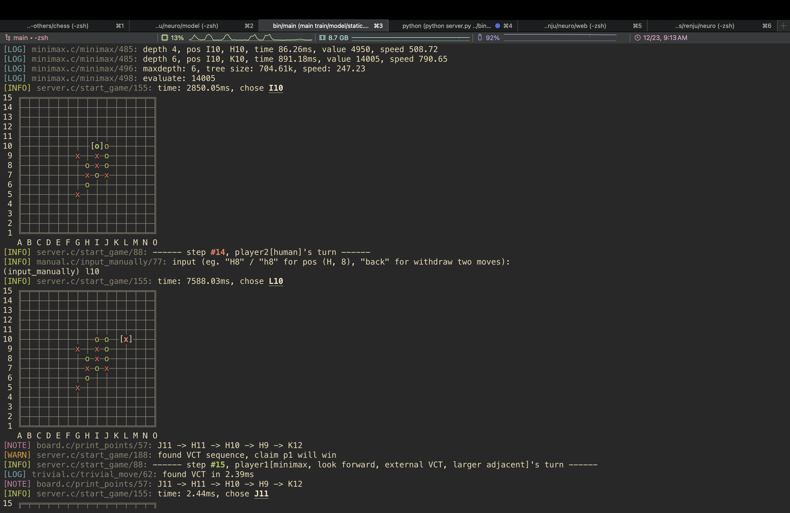
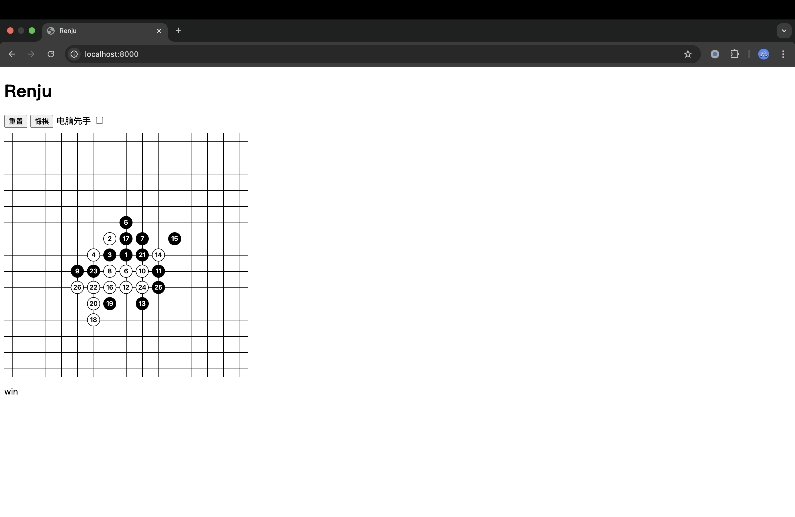

# Renju

Usage:

```shell
cmake -Bbuild
cmake --build build --target main
bin/main
# if needs neural network, just add an argument, e.g. `bin/main model/static.v5.128ch.mod`
```

Targets: 
- main: `bin/main`, game launcher
- botzone: `bin/botzone`, bot using [botzone simplified I/O protocol](https://wiki.botzone.org.cn/index.php?title=Bot#.E4.BA.A4.E4.BA.92)
- test: `bin/test`, unit tests 
- generate\_bindings: `train/lib/librenju.py`, generate python bindings for training neural network

[Notes](notes.md)

Features:

- Monte-Carlo Tree Search algorithm with a tiny CNN

- Minimax algorithm with alpha-beta prunning

- A C implementation of Threat-Space Search algorithm ([Allis, L. & Herik, H. & Huntjens, M.. (1994). Go-Moku and Threat-Space Search. Computational Intelligence. 12. ](https://www.researchgate.net/publication/2252447_Go-Moku_and_Threat-Space_Search))

Demo:



---

Includes a simple web UI compatible with any bot using botzone simplified I/O protocol.

Usage:

1. Go to the `web/` directory

2. Launch `server.py` with a bot file path, e.g. `python server.py ../bin/botzone`

3. Open website by `anywhere` (maybe need to install `anywhere` by `npm install anywhere -g` first)

note: If port conflicts with any other program, try execute `anywhere -p [new port]` for website, or modify `config.json` for server.


