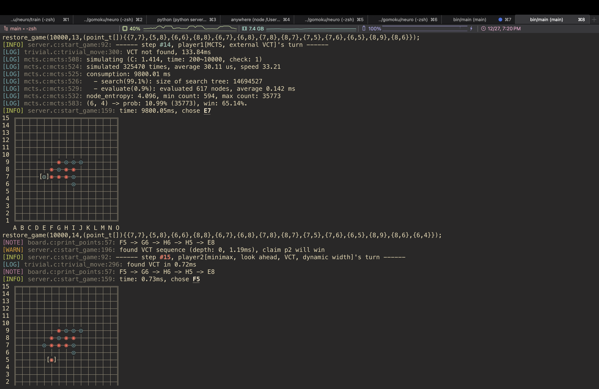

# Renju

Usage:

```shell
cmake -Bbuild
cmake --build build --target main
bin/main
# if needs neural network, just add an argument, e.g. `bin/main model/static.v5.128ch.mod`
```

Targets: 
- main: `bin/main`, game launcher
- botzone: `bin/botzone`, bot using [botzone simplified I/O protocol](https://wiki.botzone.org.cn/index.php?title=Bot#.E4.BA.A4.E4.BA.92)
- test: `bin/test`, unit tests 
- librenju: `bin/librenju`, dynamic library for python code
- generate\_bindings: `train/lib/librenju.py`, generate python bindings for training neural network
- all

[Notes](notes.md)

Features:

- An implementation of Threat-Space Search algorithm ([Allis, L. & Herik, H. & Huntjens, M.. (1994). Go-Moku and Threat-Space Search. Computational Intelligence. 12. ](https://www.researchgate.net/publication/2252447_Go-Moku_and_Threat-Space_Search))

- Tiny neural network framework in C

- Monte-Carlo Tree Search algorithm with ResNet

- A self-playing python script, build neural network from scratch

- Acceleration library: OpenMP, BLAS

Demo:



---

Includes a simple web UI compatible with any bot using botzone simplified I/O protocol.

Usage:

1. `git submodule init`

2. see `web/README.md`

